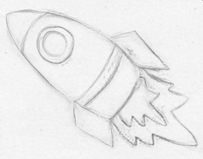
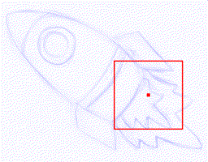
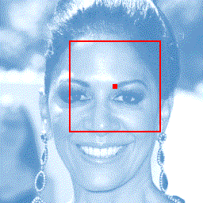

# General Virtual Sketching Framework for Vector Line Art - SIGGRAPH 2021

[Paper](https://esslab.jp/publications/HaoranSIGRAPH2021.pdf) | [Project Page](https://markmohr.github.io/virtual_sketching/)


&nbsp;&nbsp;&nbsp;&nbsp;

## Outline
- [Dependencies](#dependencies)
- [Testing with Trained Weights](#testing-with-trained-weights)
- [Training](#training)
- [Citation](#citation)

## Dependencies
 - [Tensorflow](https://www.tensorflow.org/) (1.12.0 <= version <=1.15.0)
 - [opencv](https://opencv.org/) == 3.4.2
 - [pillow](https://pillow.readthedocs.io/en/latest/index.html) == 6.2.0
 - [scipy](https://www.scipy.org/) == 1.5.2
 - [gizeh](https://github.com/Zulko/gizeh) == 0.1.11

## Testing with Trained Weights
### Model Preparation

Download the models [here](https://drive.google.com/drive/folders/1-hi2cl8joZ6oMOp4yvk_hObJGAK6ELHB?usp=sharing): 
  - `pretrain_clean_line_drawings` (105 MB): for vectorization
  - `pretrain_rough_sketches` (105 MB): for rough sketch simplification
  - `pretrain_faces` (105 MB): for photograph to line drawing

Then, place them in this file structure:
```
outputs/
    snapshot/
        pretrain_clean_line_drawings/
        pretrain_rough_sketches/
        pretrain_faces/
```

### Usage
Choose the image in the `sample_inputs/` directory, and run one of the following commands for each task. The results will be under `outputs/sampling/`.

``` python
python3 test_vectorization.py --input muten.png

python3 test_rough_sketch_simplification.py --input rocket.png

python3 test_photograph_to_line.py --input 1390.png
```

**Note!!!** Our approach starts drawing from a randomly selected initial position, so it outputs different results in every testing trial (some might be fine and some might not be good enough). It is recommended to do several trials to select the visually best result. The number of outputs can be defined by the `--sample` argument:

``` python
python3 test_vectorization.py --input muten.png --sample 10

python3 test_rough_sketch_simplification.py --input rocket.png --sample 10

python3 test_photograph_to_line.py --input 1390.png --sample 10
```

**Reproducing Paper Figures:** our results (download from [here](https://drive.google.com/drive/folders/1-hi2cl8joZ6oMOp4yvk_hObJGAK6ELHB?usp=sharing)) are selected by doing a certain number of trials. Apparently, it is required to use the same initial drawing positions to reproduce our results.

### Additional Tools

#### a) Visualization

Our vector output is stored in a `npz` package. Run the following command to obtain the rendered output and the drawing order. Results will be under the same directory of the `npz` file.
``` python
python3 tools/visualize_drawing.py --file path/to/the/result.npz 
```

#### b) GIF Making

To see the dynamic drawing procedure, run the following command to obtain the `gif`. Result will be under the same directory of the `npz` file.
``` python
python3 tools/gif_making.py --file path/to/the/result.npz 
```


#### c) Conversion to SVG

Our vector output in a `npz` package is stored as Eq.(1) in the main paper. Run the following command to convert it to the `svg` format. Result will be under the same directory of the `npz` file.

``` python
python3 tools/svg_conversion.py --file path/to/the/result.npz 
```
  - The conversion is implemented in two modes (by setting the `--svg_type` argument):
    - `single` (default): each stroke (a single segment) forms a path in the SVG file
    - `cluster`: each continuous curve (with multiple strokes) forms a path in the SVG file

**Important Notes**

In SVG format, all the segments on a path share the same *stroke-width*. While in our stroke design,  strokes on a common curve have different widths. Inside a stroke (a single segment), the thickness also changes linearly from an endpoint to another. 
Therefore, neither of the two conversion methods above generate visually the same results as the ones in our paper.
*(Please mention this issue in your paper if you do qualitative comparisons with our results in SVG format.)*


<br>

## Training

### Preparations

Download the models [here](https://drive.google.com/drive/folders/1-hi2cl8joZ6oMOp4yvk_hObJGAK6ELHB?usp=sharing): 
  - `pretrain_neural_renderer` (40 MB): the pre-trained neural renderer
  - `pretrain_perceptual_model` (691 MB): the pre-trained perceptual model for raster loss

Download the datasets [here](https://drive.google.com/drive/folders/1-hi2cl8joZ6oMOp4yvk_hObJGAK6ELHB?usp=sharing): 
  - `QuickDraw-clean` (14 MB): for clean line drawing vectorization. Taken from [QuickDraw](https://github.com/googlecreativelab/quickdraw-dataset) dataset.
  - `QuickDraw-rough` (361 MB): for rough sketch simplification. Synthesized by the pencil drawing generation method from [Sketch Simplification](https://github.com/bobbens/sketch_simplification#pencil-drawing-generation).
  - `CelebAMask-faces` (370 MB): for photograph to line drawing. Processed from the [CelebAMask-HQ](https://github.com/switchablenorms/CelebAMask-HQ) dataset.
  
Then, place them in this file structure:
```
datasets/
    QuickDraw-clean/
    QuickDraw-rough/
    CelebAMask-faces/
outputs/
    snapshot/
        pretrain_neural_renderer/
        pretrain_perceptual_model/
```

### Running

It is recommended to train with multi-GPU. We train each task with 2 GPUs (each with 11 GB).

``` python
python3 train_vectorization.py

python3 train_rough_photograph.py --data rough

python3 train_rough_photograph.py --data face
```

<br>

## Citation

If you use the code and models please cite:

```
@article{mo2021virtualsketching,
  title   = {General Virtual Sketching Framework for Vector Line Art},
  author  = {Mo, Haoran and Simo-Serra, Edgar and Gao, Chengying and Zou, Changqing and Wang, Ruomei},
  journal = {ACM Transactions on Graphics (Proceedings of ACM SIGGRAPH 2021)},
  year    = {2021},
  volume  = {40},
  number  = {4},
  pages   = {51:1--51:14}
}
```


